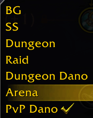

# Reorder Talent Loadouts

A lightweight World of Warcraft addon that adds drag-and-drop reordering functionality to the talent loadout dropdown.

## Usage

Open your talents, open the loadout dropdown, then **click and hold** a loadout and drag it up or down. A yellow line marks where it will land; release to drop.

An undo-arrow button next to the dropdown (visible only while it's open and you've customized the order) resets the current spec back to the default order.

## Details

- Orders persist per character and per specialization across reloads, logouts and client restarts.
- Zero configuration, near-zero overhead — no polling, everything is event-driven.
- Non-intrusive: normal clicks, the gear menu and other addons keep working untouched.

## Compatibility

WoW Midnight (12.x). Drag is aborted automatically when entering combat (WoW rule, not a limitation).

## License

GNU General Public License v2.0. See [LICENSE](LICENSE) for details.
